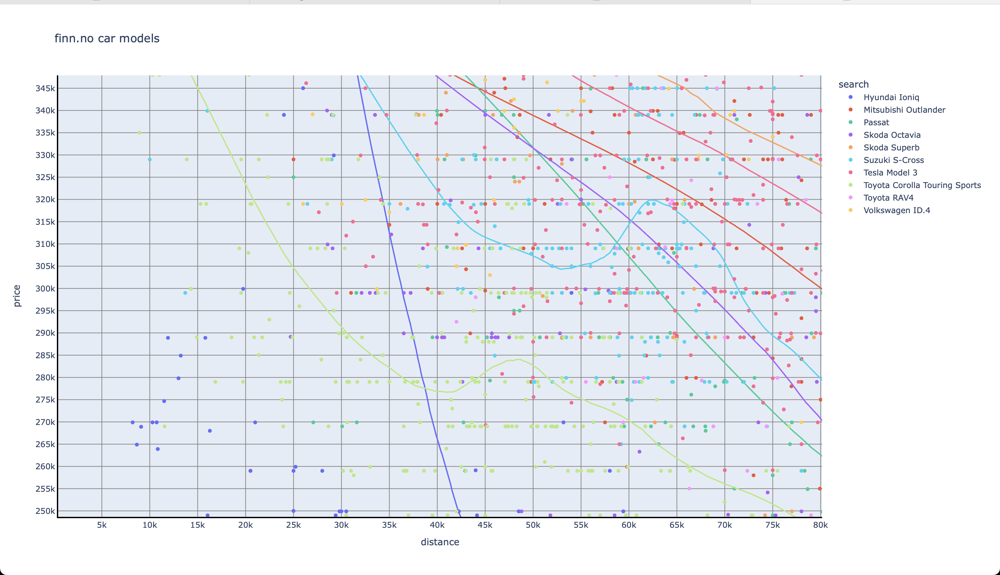

# Finn Carstats

What is the best family car one can buy in 2024? It depends on what you are looking for at what budget. There is no single answer.
However there are good byes and bad buys. This collection of data sets are meant to help myself find a good car for my familiy.

## Criteria

What does that mean in practice? We have a lot of expectations, but also some requirements

* **SluggageSspace** The trunk must be large. It must have a trunk fitting at least 440 liters.
* **Price** The car can cost up to 330 000 kr. maybe an extra salary is available if we break the bank. Go below 250 000 kr and the cars becomes irellevant.
* **Hybrid or Electric** The year is 2024. We wanted an electric car at some level.
* **Age** The car must not be more than 3 years.
* **Driving Distance** The car must not have passed the 70 000 km on the road.

## How does it Work?

This package contains a script which can look for, and download car ads from [finn.no](https://finn.no). it collects relevant numbers and dumps them to a file. Run the script a couple of times and you have all the information needed stored on files.

Once you have the files run the script './aggregate.sh' to store the files on a single place to draw them.

Finally run the python notebook `drawer.ipynb` to show the graphs you need.

## Findings

there are my findings

### Price over Distance

Price and distance traveled are important factors. The price is measured in NOK and the distance in kilometers.
A [lowess](https://www.statisticshowto.com/lowess-smoothing/) trend line is drawn for each of the car models.

**Hyundai Ioniq** (in dark blue) is short travelled and has a low price. It has a small trunk and storage space. Also the Hyundai Ioniq must not be mixed up with Hyundai Ioniq 5 which is completely different in size and volume. Hyundai Ioniq It is not really a family car but rather a car for couples or singles.

This graph mixes the two models. Therefore the blue trend line which falls like a rock.

**Toyota Corolla Touring Sports** (in light green) is by far the cheapest family car in this  selection of models. I am betting it is the best value for money family car in the world. Toyota's customer service is excellent, and the model has few mistakes and errors.

**Suzuki S-cross** (in turquoise color) got this strange bump in price around 62 000 km. Further investigation revealed that [Hertz](https://www.hertz.com) is selling their car pool of this model. This shakes up the market with artificially low prices between 40 000 km and 62 000 km traveled. These cars are cheap!

**Skoda Octavia** In purple. Comes in pure gas and plug-in hybrid. The gas version is cheap. whilei the hybrid is hard to find.

**Passat** in dark green. There are very few of those around...

**Mitsubishi Outlander** dark red. Is a quite common and succesful Plug-in hybrid. starting to approache the end of the price range.

**Tesla Model 3** (dark pink) A expensive car and a cheap car all at the same time. A wild card. The sales numbers are really high, and if you are lucky you can If I only could find one where the listing price is just 320 000 and driving distance is just below 70 000 km.

**Skoda Superb** (orange) It is big. it is expensive. If you only could afford the superb...

