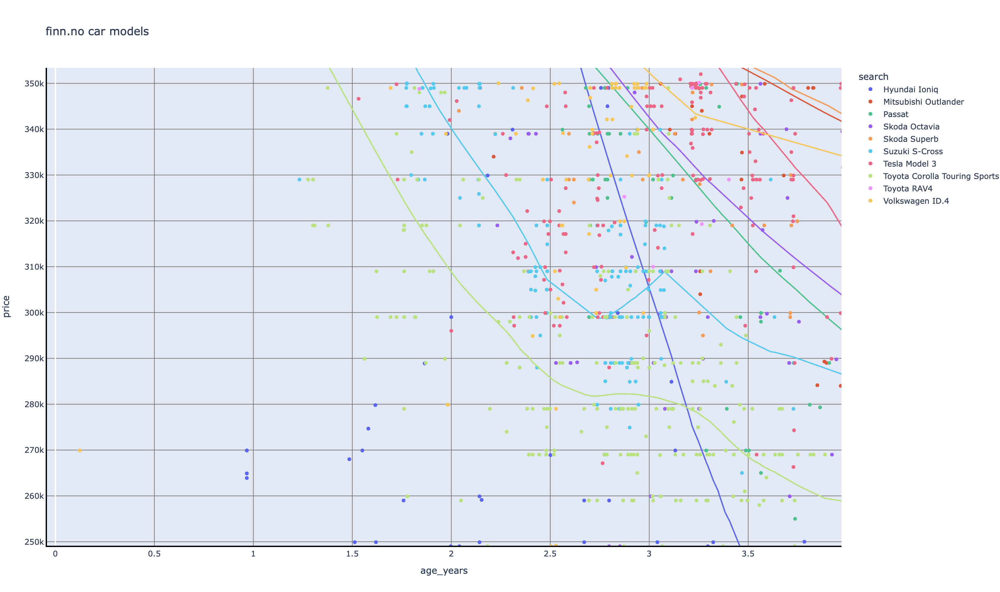
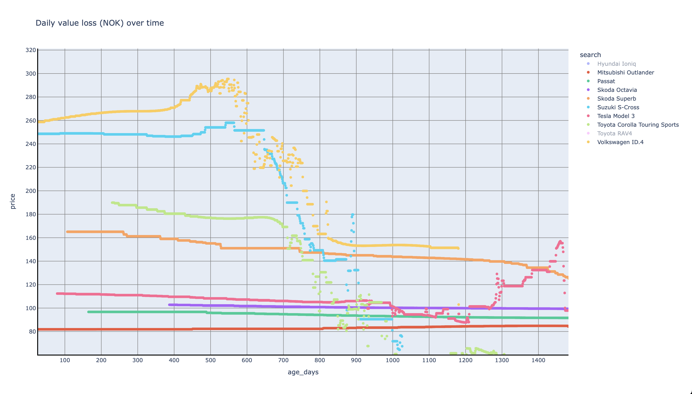

# Finn Carstats

What is the best family car one can buy in 2024? It depends on what you are looking for at what budget. There is no single answer.
However there are good byes and bad buys. This collection of data sets are meant to help myself find a good car for my familiy.

## Criteria

What does that mean in practice? We have a lot of expectations, but also some requirements

* **Luggage Sspace** The trunk must be large. It must have a trunk fitting at least 440 liters.
* **Price** The car can cost up to 330 000 kr. maybe an extra salary is available if we break the bank. Go below 250 000 kr and the cars becomes irellevant.
* **Hybrid or Electric** The year is 2024. We wanted an electric car at some level.
* **Age** The car must not be more than 3 years.
* **Driving Distance** The car must not have passed the 70 000 km on the road.

## How does it Work?

This package contains a script which can look for, and download car ads from [finn.no](https://finn.no). it collects relevant numbers and dumps them to a file. Run the script a couple of times and you have all the information needed stored on files.

Once you have the files run the script './aggregate.sh' to store the files on a single place to draw them.

Finally run the python notebook `drawer.ipynb` to show the graphs you need.

## Findings

there are my findings

### Price over Distance

Price and distance traveled are important factors. The price is measured in NOK and the distance in kilometers.
A [lowess](https://www.statisticshowto.com/lowess-smoothing/) trend line is drawn for each of the car models.


**Hyundai Ioniq** (in dark blue) is short travelled and has a low price. It has a small trunk and storage space. Also the Hyundai Ioniq must not be mixed up with Hyundai Ioniq 5 which is completely different in size and volume. Hyundai Ioniq It is not really a family car but rather a car for couples or singles.

This graph mixes the two models. Therefore the blue trend line which falls like a rock.

**Toyota Corolla Touring Sports** (in light green) is by far the cheapest family car in this  selection of models. I am betting it is the best value for money family car in the world. Toyota's customer service is excellent, and the model has few mistakes and errors.

**Suzuki S-cross** (in turquoise color) got this strange bump in price around 62 000 km. Further investigation revealed that [Hertz](https://www.hertz.com) is selling their car pool of this model. This shakes up the market with artificially low prices between 40 000 km and 62 000 km traveled. These cars are cheap!

**Skoda Octavia** In purple. Comes in pure gas and plug-in hybrid. The gas version is cheap. whilei the hybrid is hard to find.

**Passat** in dark green. There are very few of those around...

**Mitsubishi Outlander** dark red. Is a quite common and succesful Plug-in hybrid. starting to approache the end of the price range.

**Tesla Model 3** (dark pink) A expensive car and a cheap car all at the same time. A wild card. The sales numbers are really high, and if you are lucky you can If I only could find one where the listing price is just 320 000 and driving distance is just below 70 000 km.

**Volkswagen ID.4** (light orange). It is the first electic SUV from Volkswagen. It jus takes the spot up in the right corner (expensive with long distance traveled). The trendline falls quickly with a steep angle.

**Skoda Superb** (dark orange) It is outside this graph. It is big. t is expensive. If you only could afford the superb...

**Toyota RAV4** It is outside this graph. It is big.

### Price over Age

n Norway a lot of cars ends on the landfill due to rust. So also Age of the car is a factor. I also measured the number of days since the car was registered.
Once again a [lowess](https://www.statisticshowto.com/lowess-smoothing/) trend line is drawn for each of the car models.



The graphs has the same general trends as _Price over Distance_. The colors are the same.

### Price over Age and Distance

I wanted to find the optimal price for the distance **and** age. To do that I took the hypothenuse of the two. That way we say that distance and age are equally important.

```python
max_days = df['age_days'].max()
max_distance = df['distance'].max()
df['hypotenuse of days and distance'] = np.hypot(df['age_days'] / max_days, df['distance'] / max_distance)
```

With this technique everything in the lower left corneris a lot of car for the money. These are cheap cars with low km and few days of age.
On the top right corner you will find the opposite. These are expensive cars with a lot of days of age.

The drawback is that the x-axis does not make intuitive sense. we are working with a scale from 0.02 to 0.28.


If we ignore the **Hyundai Ioniq** due to the mixup between the different versions of the Ioniq and the Ioniq 5 we start seeing some clear trends now. The most car for the money between 250 000 kr and 350 000 kr is in the following order;

1. **Toyota Corolla Touring Sports**
2. **Suzuki S-Cross**
3. **Volkswagen Passat**
4. Skoda Octavia
5. Tesla Model 3
6. Mitsubishi Outlander
7. Volkswagen ID.4
8. Skoda Superb
9. Toyota RAV4

Thew first 3 lines are quite clear. However there is a small distance after the second place. The trend lines tend to "meld together". They follow almost the same lines prices.

### Daily Value Loss

The last thing which is important is to know what it costs to own the car.
Gas, insurence and other factors are easy to find. The prices are "fixed" at the vendor. When you own the car you will loose the value just by letting the car be parked for a day. This can be observed when you wrack or sell the car. The price will be lower, this cost was "averaged out" over the years the car was driving.

We imagine the car has a high price new before it loses value quickly as soon as it goes into the second hand market. After a while the loss per year decreases.

The last graph shows what it costs to own the car per day. It ignores the driving and only focus of the value loss the car getting older. I hope you got used to [lowess](https://www.statisticshowto.com/lowess-smoothing/) trend lines by now. Because this graph basically shows the derivative of the lowess trend lines from the pevious graphs.



**Disclaimer** Noone buys a car just to sell it the next day. It would be stupid. Some cars don't show up on the second hand marked before 100 days has passed. Hence the lines are not starting at age_days (on the x-axis) on 0. In fact all values below 365 are highly artifical due to too few samples.

After 400 days the cars which are the cheapest to won are;

1. Mitsubishi Outlander 82kr
2. Volkwagen Passat 96kr
3. Skoda Octavia 103kr
4. Tesla Model 3 108kr
5. Skoda Superb  159kr
6. Toyota Corolla Touring Sports 180kr
7. Suzuki S-cross 246kr
8. Volkswagen ID.4 270kr

The Mitsubishi Outlander and the Skoda Superb are two expensive cars on thi segment which keeps their value well an has high prices in the second hand market.The same can not be said about Corolla, which costs 180kr per day. That is an insight.

Something happends beween day 600 and 900. That is when most of the the graphs "fall" to a new level. that is probably when the first large bulk of sellers start selling their cars on the second hand market. We can guess that this is a trend an that supply (used cars) is meeting demand (car buyers) at a new level.


This graph correspond directly with the change of angle on the trend lines under _price over age (days)_.

After 900 days the cars which are the cheapest to won are;

1. Mitsubishi Outlander 83kr
2. Volkwagen Passat 94kr
3. Toyota Corolla Touring Sports 99kr
4. Skoda Octavia 100kr
5. Tesla Model 3 106kr
6. Suzuki S-cross 132kr
7. Skoda Superb 145kr
8. Volkswagen ID.4 153kr

After 900 days the Toyota Corolla Touring Sports is done loosing value quickly It costs marely 99kr per day. :)
Skoda Octavia and Tesla Model 3 close by.

I have no explaination why the passat and the outlander ends up at place 1 and 2. We can guess they are rare in this price range, and not really representative.

## Conclusions

This is what I learned

### Second Hand

Another insight is that cars does not last forever in the second hand market. After 6 to 7 years most models almost disappears from the second hand market. Most likely the car drives for some more years, but the seller is not capable to shine it up for selling. keep that in mind if you plan to sell.

### Best Buy

Between 800 and 900 days after inital registration is the optimal time to by second hand. That is when the value loss on most cars starts decreasing.

At this point you probably want to by these cars in decreasing "goodness"

1. Toyota Corolla Touring Sports
2. Suzuki S-cross
3. Tesla Model 3

this is based on the graph _Price over Age and Distance_ and what is likely to find in the market.

But the other models are not bad choices. You can be lucky. If you are you can save 50 000kr by finding the best seller at the best price. In this price segment margins are small. Different models differ in just 10 000kr. A good of a "bad" model can change the investment completely.

A car is more than price and distance. I ended up discarding the tesla model 3 because the lid on the trunk is too small, and the toyota corolla because it was just boring.

A car is a life choice and also an asset. That is why you should think before you spend your money.

Use these scripts and this insight to buy your car economically.
